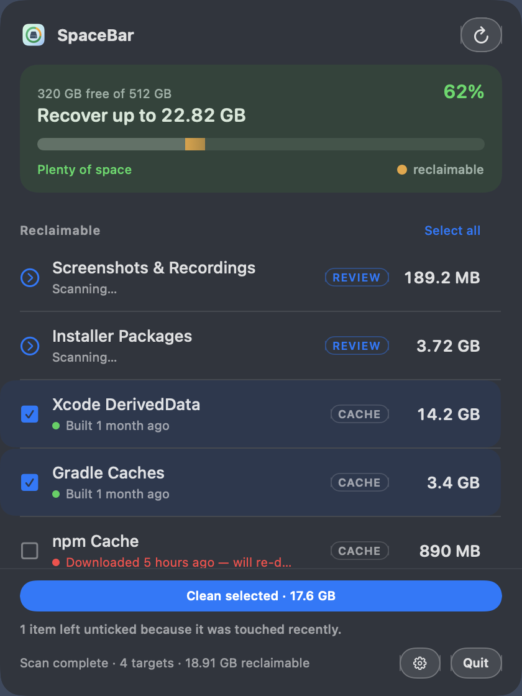
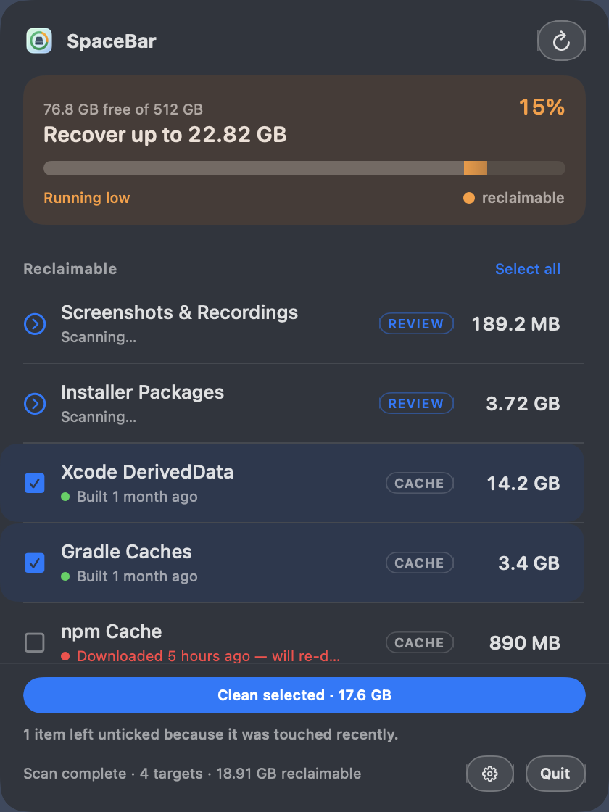
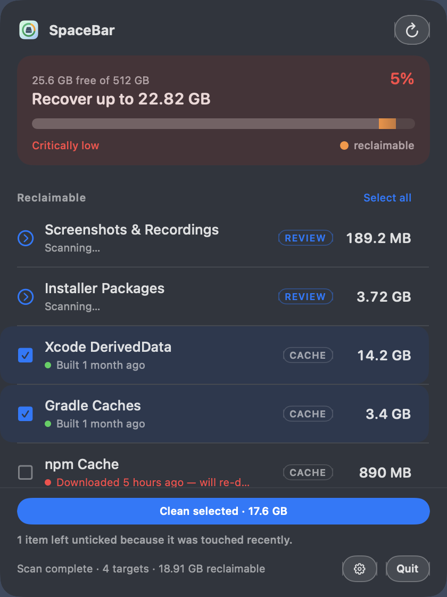

# SpaceBar

SpaceBar is a macOS menu bar app for reclaiming disk space without digging through Finder.

Developer machines fill up with regenerable junk: Xcode DerivedData, package caches, simulators, Docker build cache, temp files, and piles of screenshots. Trash does not free space until you empty it. SpaceBar makes that reclaimable space visible and removable from one panel.

<p align="center">
  
</p>

<p align="center">
  
  &nbsp;
  
  &nbsp;
  
</p>

<p align="center">
  
  
  
</p>

**Copyright © 2026 Muddassir Iqbal**

## What it does

- Shows free disk space in the menu bar as a colored pill (green when plenty is free, orange under 20%, red under 10% — both thresholds configurable)
- Scans known cache and cleanup locations and lists how much each can free, sorted by payoff
- Tells you how long ago each target was actually touched, in its own words — "Built 20 minutes ago", "Downloaded 40 days ago", "Newest item trashed 2 weeks ago"
- Pre-selects only what is old enough to be safe, and says why anything was held back
- Reclaims everything you ticked in one press, after a confirmation that lists exactly what goes
- Empties Trash via Finder when you choose Empty Trash (never pre-selected — it is the one irreversible target)
- Lets you review screenshots and screen recordings as one item, select what to delete, and keep the rest
- Lets you review downloaded installer packages (`.dmg`, `.pkg`, `.iso`) as a separate item, select what to delete, and keep the rest

### Choosing a layout

The panel's list, selection and cleanup button are the same whichever layout you pick — only the
header above them changes, so the choice is about how much room the overview gets:

| Layout | Header | Best when |
| --- | --- | --- |
| **Gauge** (default) | Capacity meter with recoverable space as the headline | You want the summary and the rows both visible |
| **Ledger** | A single thin bar | You want as many rows on screen as possible |
| **Map** | Treemap where area is bytes and color is recency | You want to see at a glance what is eating the disk |

Map needs at least 3 items to draw — one or two tiles say less than a bar does. Below that it
shows Gauge and says why, rather than silently ignoring your choice. There is no minimum size:
proportion reads the same whether the total is 40 MB or 40 GB. Small targets fold into one
"Everything else" tile rather than becoming unreadable slivers.

### Settings

Open Settings from the gear in the panel footer; it slides in over the panel.

| Section | Controls |
| --- | --- |
| Look | Layout, menu bar pill style, percentage vs size, row density |
| Limits | Warning and critical thresholds, each restated in GB against your actual disk |
| Scanning | How old counts as stale, which targets to scan at all, rescan on open |

"Stale" is one number driving three things: when an age turns amber, what the review filter chip
says, and what arrives pre-selected.

Sizes use decimal GB (1 GB = 1,000³ bytes), same style as System Settings → Storage.

## Tech stack

| Layer | Choice |
| --- | --- |
| Language | Swift 5 |
| UI | SwiftUI |
| Menu bar / panel | AppKit (`NSStatusItem`, `NSPanel`) so the free-space pill can stay colored |
| Project generation | [XcodeGen](https://github.com/yonaskolb/XcodeGen) (`project.yml`) |
| Snapshot tests | [swift-snapshot-testing](https://github.com/pointfreeco/swift-snapshot-testing) |
| Platform | Native macOS app (non-sandboxed, Hardened Runtime) |
| Tooling | SwiftFormat + SwiftLint (pre-build scripts, warnings as errors) |

No third-party runtime dependencies. Cleanup and sizing use Foundation, `Process` (`du`, `rm`, `simctl`, `docker`, Finder via AppleScript), and system APIs.

## Prerequisites

### To use SpaceBar

- macOS 14 Sonoma or later
- A built `SpaceBar.app` (from Releases or built locally)
- Full Disk Access for some cleanups; Automation access to Finder for Trash (prompted when needed)

Optional tools only matter if you clean those targets (Xcode, Docker, pnpm, and so on). SpaceBar skips targets that are not present.

### To build from source

- macOS 14+
- Xcode 15+ (Command Line Tools / `xcodebuild`)
- [XcodeGen](https://github.com/yonaskolb/XcodeGen) (`brew install xcodegen`)

Optional: [SwiftFormat](https://github.com/nicklockwood/SwiftFormat) and [SwiftLint](https://github.com/realm/SwiftLint) for local checks (also run automatically on build if installed).

## How it works

SpaceBar runs as a menu-bar-only app (no Dock icon). Click the pill to open the panel.

On open it scans cleanup targets under your home folder (and process temp), measures reclaimable size, and shows only targets that have something to free. Cleaning uses a path allowlist so deletes stay limited to approved cache locations. Sensitive targets ask for a stronger confirmation.

Screenshots and recordings are found by common macOS filenames (`Screenshot…`, `Screen Recording…`) in Desktop, Pictures, Movies, Downloads, and your custom screencapture folder if it is under your home directory. Downloaded installer packages (`.dmg`, `.pkg`, `.iso`) are found in Downloads and Desktop and shown as their own item. Both are review lists: you pick what to remove, and nothing is deleted until you confirm.

Some folders need Full Disk Access. Emptying Trash may need Automation access to Finder.

## How to use

1. Launch SpaceBar. The free-space pill appears in the menu bar.
2. Click the pill to open the panel. Wait for the first scan to finish.
3. Read the headline: how much you can recover, and what it costs. Anything untouched for longer
   than your stale setting arrives already ticked.
4. Adjust the ticks. Rows touched recently are left off deliberately — the age line tells you what
   cleaning one would cost ("forces a full rebuild", "will re-download").
5. Press **Clean selected**, read the list in the confirmation, then confirm to delete permanently.
6. For screenshots, recordings and installers, open the row to review individual files before
   deleting.
7. Use the refresh control to rescan sizes and free space after cleaning.

Quit from the panel footer when you are done, or leave it running for a live free-space meter.

### Permissions

**Full Disk Access** (needed for some Library caches and related cleanups):

1. System Settings → Privacy & Security → Full Disk Access
2. Enable SpaceBar (add the `.app` with + if it is missing)
3. Quit and reopen SpaceBar

Debug builds are tied to the built binary path. After rebuilding, toggle access off/on or re-add the app.

**Automation → Finder** may be requested the first time Trash size or Empty Trash runs.

### Cleanup targets

| Area | Examples |
| --- | --- |
| General | User temp files, app caches |
| Xcode | DerivedData, Archives, iOS DeviceSupport, unavailable simulators |
| Android / Java | AVDs, Gradle caches |
| Packages | CocoaPods, SwiftPM, npm, pnpm |
| Tools | Homebrew, uv, pip, Docker build cache |
| Trash | Empty Trash |
| Media | Screenshots and screen recordings (review before delete) |
| Installers | Downloaded installer packages — `.dmg`, `.pkg`, `.iso` (review before delete) |

Caches are regenerable; the next build or install may take longer. Archives, AVDs, and Trash are treated as higher risk and use stronger confirmation.

## Build from source

```bash
cd ~/Projects/SpaceBar
xcodegen generate
xcodebuild -scheme SpaceBar -configuration Debug -derivedDataPath build build
open build/Build/Products/Debug/SpaceBar.app
```

Or open `SpaceBar.xcodeproj` in Xcode and run.

```bash
swiftformat SpaceBar SpaceBarTests --config .swiftformat
swiftlint lint --config .swiftlint.yml --strict SpaceBar SpaceBarTests
```

## Snapshot tests

UI snapshots cover the cleanup panel and menu bar pill for three free-space levels:

| Case | Free space | Color |
| --- | --- | --- |
| Good | ~62% free | Green |
| Low | 15% free | Orange |
| Critical | 5% free | Red |

Fixtures seed fixed disk/cache/media data so images stay stable.

```bash
xcodegen generate
xcodebuild -scheme SpaceBar -destination 'platform=macOS,arch=arm64' -derivedDataPath build test
```

Ledger and Map layouts, the settings sections, and the treemap layout algorithm have their own
tests. Reference images live in `SpaceBarTests/__Snapshots__/`. README assets under `Docs/` are refreshed when the snapshot tests run (`spacebar-panel-*.png`, `spacebar-pill-*.png`).

To re-record after intentional UI changes, delete the references and run the suite — missing
references are always written back:

```bash
rm -f SpaceBarTests/__Snapshots__/PanelSnapshotTests/*.png
xcodebuild -scheme SpaceBar -destination 'platform=macOS,arch=arm64' -derivedDataPath build test  # records, reports failures
xcodebuild -scheme SpaceBar -destination 'platform=macOS,arch=arm64' -derivedDataPath build test  # verifies
```

`SNAPSHOT_TESTING_RECORD=all` does not work here — `xcodebuild` does not forward it to the test
process, so the run silently compares instead of recording. The giveaway is a failure saying
"does not match reference" rather than "Automatically recorded snapshot".

## Project layout

```
SpaceBar/
├── project.yml
├── Docs/spacebar-panel.png
├── SpaceBar.xcodeproj
├── SpaceBar/
│   ├── Models/
│   ├── Services/
│   ├── Views/
│   └── Utilities/
└── SpaceBarTests/
    ├── PanelSnapshotTests.swift
    ├── Support/
    └── __Snapshots__/
```

## License

Copyright © 2026 Muddassir Iqbal

Licensed under the [MIT License](LICENSE).
